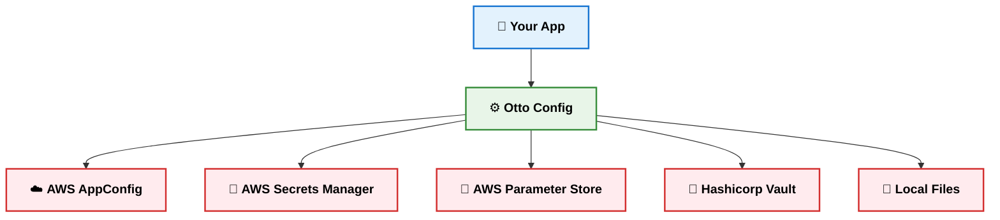
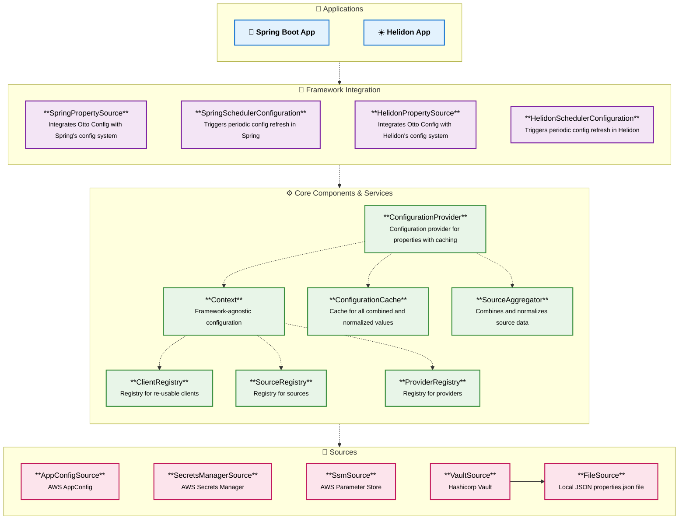
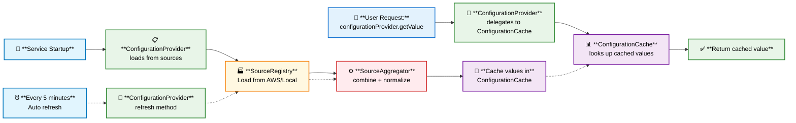

# Otto Config


A Java library for dynamic, centralized configuration management using AWS AppConfig, Secrets Manager, Parameter Store and Hashicorp Vault. Otto Config lets you update feature toggles and application properties across distributed services without redeploying code. It streamlines configuration changes, making updates seamless and automatic for your applications.

## Table of Contents
- [✨ Features](#features)
- [☁️ Sources](#️-sources)  
- [⚙️ Configuration](#️-configuration)
- [🚀 Quick Start](#-quick-start)
- [🔌 Framework Integration](#-framework-integration)
- [🏗️ Architecture](#️-architecture)
- [⚖️ Priority Order](#️-priority-order)
- [🔧 Adding Custom Sources](#-adding-custom-sources)
- [🛠️ Implementing a Custom Provider (Advanced Use Case)](#️-implementing-a-custom-provider-advanced-use-case)
- [📚 Demo Projects](#-demo-projects)
- [📊 Project Documentation](./docs)

## ✨ Features

- **🚀 Fast Setup:** Simply add the dependency and specify your desired configuration sources
- **🔄 Auto Refresh:** Updates every 5 minutes, no restarts
- **📊 Unified API:** Access properties and toggles from one place
- **🌐 Framework Support:** Auto-registers as a property source for Spring and Helidon; works with plain Java too

## ☁️ Sources

Otto Config unifies all your configuration—**⚙️ properties** and **🚩 feature toggles**—from multiple sources into a single, consistent setup for your application. Each source (such as AWS AppConfig, Secrets Manager, Parameter Store, or local files) is merged through the `ConfigurationProvider` and auto-registered as a property source for Spring or Helidon, making all configuration values available via standard framework annotations and injection. In plain Java, you can access configuration directly using the `ConfigurationProvider` API.

### Sources vs. Providers

- **Sources** are the raw origins of configuration data (e.g., AWS AppConfig, Secrets Manager, Parameter Store, Hashicorp Vault, or local files). Each source supplies one or more types of configuration: properties and toggles.
- **Providers** are the unified interfaces that aggregate and expose configuration data to your application. The main provider is the `ConfigurationProvider`, which merges all registered sources and presents them as a single, refreshable configuration.

This separation allows Otto Config to keep the logic for loading and merging configuration data independent from how your application or framework consumes it.

### How Otto Config Merges Configuration

- All registered sources are combined into a unified configuration by the `ConfigurationProvider`.
- Keys from different sources are normalized to standard Java property format (e.g., `property.name`), but original key formats (like SSM `/property/name`) are also supported for compatibility.
- Both normalized and original keys resolve to the same value, so you can use whichever format fits your needs.
- When integrating with frameworks like Spring or Helidon, Otto Config registers custom property sources that delegate to the `ConfigurationProvider`, letting you use standard mechanisms to access all configuration values. For more details and usage examples, refer to the [🔌 Framework Integration](#-framework-integration) section.

### Supported Sources

| Source                      | ⚙️ Properties | 🚩 Toggles | Use Case                                 |
|-----------------------------|:------------:|:----------:|------------------------------------------|
| **☁️ AWS AppConfig**        | ✅           | ✅         | Validated configs, deployment controls   |
| **🔐 AWS Secrets Manager**  | ✅           | ❌         | Encrypted secrets (passwords, API keys)  |
| **📝 AWS Parameter Store**  | ✅           | ❌         | Hierarchical application settings        |
| **📝 Hashicorp Vault**      | ✅           | ❌         | Encrypted secrets (passwords, API keys)  |
| **📄 Local Files**          | ✅           | ✅         | Development & testing                    |

### Extending Otto Config

For advanced scenarios, you can implement custom sources or providers to load and manage configuration for specialized needs (such as analytics or integration with external systems). See [Implementing a Custom Provider (Advanced Use Case)](#️-implementing-a-custom-provider-advanced-use-case) for details.

## ⚙️ Configuration

Before getting started with Otto Config, specify which configuration sources you want to enable. The table below lists all valid source keys and their purposes:

| Source Key                  | Provides      | Description                                 |
|-----------------------------|---------------|---------------------------------------------|
| `aws.appconfig.properties`  | Properties    | AWS AppConfig for application properties    |
| `aws.appconfig.toggles`     | Toggles       | AWS AppConfig for feature toggles           |
| `aws.secrets`               | Properties    | AWS Secrets Manager for secrets             |
| `aws.ssm`                   | Properties    | AWS Parameter Store for parameters          |
| `hashicorp.vault`           | Properties    | Hashicorp Vault for secrets                 |

Enable sources in your `application.properties`:

```properties
otto.config.sources.enabled=aws.appconfig.properties,aws.appconfig.toggles,aws.secrets,aws.ssm,hashicorp.vault
```

## 🚀 Quick Start

### 1. Add Dependency

```groovy
dependencies {
    implementation "de.otto.config:3.2.6"
}
```

### 2. Local Development Setup

Create `src/main/resources/properties.json`:

```json
{
  "properties": {
    "database.url": "jdbc:h2:mem:testdb",
    "feature.search.enabled": "true"
  },
  "toggles": {
    "new_feature": { "enabled": true }
  }
}
```

Set profile for local development or testing:
```bash
# Spring Boot
--spring.profiles.active=local

# Helidon  
-Dmp.config.profile=local
```
> **Note:** For unit or integration tests, you can set the profile to 'test' or 'integration-test' respectively.

### 3. Source Setup

<details>
<summary>🔧 AWS AppConfig</summary>

**Terraform Module:**
```terraform
module "appconfig_service" {
  source = "git::ssh://git@github.com/otto-de/otto-config.git//terraform"
  service = var.service
  toggles_configuration_content = file("${path.module}/appconfig_toggles.json") 
  properties_configuration_content = file("${path.module}/appconfig_properties.json")

  # Optional: enable event-driven refresh via EventBridge → SQS
  # This provisions the SQS queue and EventBridge rules for AppConfig, Secrets Manager, and SSM.
  # Set change_notification_consumer_role_arn to the IAM role ARN of your service so it can consume the queue.
  change_notification_enabled           = true
  change_notification_consumer_role_arn = aws_iam_role.service_role.arn
}
```

> **Note:** When `change_notification_enabled` is enabled, the module creates an SQS queue and EventBridge rules that detect changes to AppConfig, Secrets Manager, and SSM Parameter Store. To enable push-based configuration refresh in your application, configure both properties using the `change_notification_queue_url` Terraform output:
> ```properties
> otto.config.aws.change.notifications.enabled=true
> otto.config.aws.change.notifications.queue.url=<terraform-output-value>
> ```

**Configuration Files:**

**Properties** (`appconfig_properties.json`):
```json
{
  "properties": {
    "database.url": "jdbc:postgresql://prod-db:5432/myapp",
    "feature.search.enabled": "true",
    "cache.timeout": "3600"
  }
}
```

**Toggles** (`appconfig_toggles.json`):
```json
{
  "flags": {
    "new_feature": { "name": "NEW_FEATURE" },
    "logging_enabled": { "name": "LOGGING_ENABLED" }
  },
  "values": {
    "new_feature": { "enabled": true },
    "logging_enabled": { "enabled": false }
  },
  "version": "1"
}
```

**Required IAM Permissions**

To enable Otto Config to access parameters from AWS AppConfig, ensure your application's IAM role or user has the following permissions:

```yaml
- appconfig:StartConfigurationSession
- appconfig:GetLatestConfiguration
```

</details>

<details>
<summary>🔐 AWS Secrets Manager</summary>

Configure encrypted secrets for sensitive data. You can specify a single arn or a comma-separated list of arns to use. Otto Config will load parameters from all specified arns. For example:

```properties
# application.properties

otto.config.aws.secrets.arn=arn:aws:secretsmanager:region:account:secret:your-secret-name-1,arn:aws:secretsmanager:region:account:secret:your-secret-name-2
```
**Required IAM Permissions**

To enable Otto Config to access secrets from AWS Secrets Manager, ensure your application's IAM role or user has the following permissions:

```yaml
- secretsmanager:GetSecretValue
- secretsmanager:ListSecrets
- secretsmanager:Describe*
- secretsmanager:BatchGetSecretValue
```

</details>

<details>
<summary>📝 AWS Parameter Store</summary>

Configure hierarchical parameters. You can specify a single prefix or a comma-separated list of prefixes to use. Otto Config will load parameters from all specified paths.

```properties
# application.properties

otto.config.aws.ssm.path.prefix=/your/app/config,/another/prefix
```

If no path is specified, Otto Config loads all accessible parameters.

**Required IAM Permissions**

To enable Otto Config to access parameters from AWS Parameter Store, ensure your application's IAM role or user has the following permissions:

```yaml
- ssm:GetParametersByPath
```

</details>

<details>
<summary>🔒 Hashicorp Vault</summary>

Configure encrypted secrets for sensitive data using Hashicorp Vault. You can specify a single path or a comma-separated list of paths to use. Otto Config will load secrets from all specified paths.

```properties
# application.properties

# Vault server connection
otto.config.hashicorp.vault.url=https://vault.example.com:8200

# Secret paths (comma-separated list or single path)
otto.config.hashicorp.vault.path=/your/app/config,/another/prefix

# Specifies how many previous versions of each secret Otto Config should load from Vault. For each key, previous versions are accessible using the format `<key>_prev<number>`, where `<number>` is 1 for the most recent previous version, 2 for the one before that, and so on. The default is `1`, meaning only the latest and one previous version are available.
otto.config.hashicorp.vault.prev.versions=2

# By default, Otto Config uses Hashicorp Vault's [AppRole authentication](https://www.vaultproject.io/docs/auth/approle) to obtain a Vault token. You must provide the `role_id` and `secret_id` for your Vault AppRole, typically via environment variables for security:
otto.config.hashicorp.vault.auth.approle.role.id=${VAULT_ROLE_ID}
otto.config.hashicorp.vault.auth.approle.secret.id=${VAULT_SECRET_ID}

# You can also use AWS IAM authentication to authenticate with Vault. This allows your application to obtain a Vault token by proving its AWS identity, without needing to manage static Vault credentials. To enable AWS IAM authentication, set the following properties in your `application.properties`:

otto.config.hashicorp.vault.auth.type=aws
otto.config.hashicorp.vault.auth.aws.region=${AWS_REGION} # (Optional) region to use; default to the current session region if not set.
otto.config.hashicorp.vault.auth.aws.role.name=search
otto.config.hashicorp.vault.auth.aws.role.arn=${AWS_ROLE_ARN} # (Optional) ARN to assume; defaults to current session role if not set.
otto.config.hashicorp.vault.auth.aws.header.value=vault-test.esb.ottogroup.com
```

> **⚠️ Security Note:** Never hardcode any secret data used for authentication. Always use environment variables to inject these credentials at runtime.
</details>

### 4. Use in Your Application

Otto Config automatically integrates through SPI - no additional configuration needed:

- **🌱 Spring Boot**: Use `@Value` and `@ConfigurationProperties`
- **☀️ Helidon**: Use `@ConfigProperty` and MicroProfile Config  
- **☕ Plain Java**: Use `ConfigurationProvider` API

> 📖 **See detailed examples in [🔌 Framework Integration](#-framework-integration)**

## 🔌 Framework Integration

### 🌱 Spring Boot

**Automatic Integration:**
- Otto Config registers as a Spring `PropertySource` (lower priority than local config)
- Properties are available via `@Value`, `@ConfigurationProperties`, and `Environment`, and you can access refreshable properties using the custom `@PropertyValue` annotation.
- Automatic refresh every 5 minutes
- **Push-based Configuration Refresh (Optional):** When enabled, Otto Config receives immediate notifications about configuration changes via EventBridge → SQS, instead of relying solely on periodic polling. The queue is fed by EventBridge rules that detect changes in AWS AppConfig, Secrets Manager, and SSM Parameter Store:
```properties
# Enable push-based configuration refresh
otto.config.aws.change.notifications.enabled=true
# SQS queue URL from Terraform output: change_notification_queue_url
otto.config.aws.change.notifications.queue.url=https://sqs.<region>.amazonaws.com/<account-id>/<queue-name>
```
> **Note:** The SQS queue and EventBridge rules are provisioned automatically by the Otto Config Terraform module when `change_notification_enabled=true`. The queue URL is available as the `change_notification_queue_url` output after applying the module.

See the [Spring Boot Demo](./demo/spring/) for a complete example of Otto Config integration.

### ☀️ Helidon  

**Automatic Integration:**
- Otto Config implements MicroProfile Config's `ConfigSource` interface
- Properties are available via `@ConfigProperty` and the `Config` API, and you can access refreshable properties using the custom `@PropertyValue` annotation.
- Automatic refresh every 5 minutes
- **Push-based Configuration Refresh (Optional):** When enabled, Otto Config receives immediate notifications about configuration changes via EventBridge → SQS, instead of relying solely on periodic polling. The queue is fed by EventBridge rules that detect changes in AWS AppConfig, Secrets Manager, and SSM Parameter Store:
```properties
# Enable push-based configuration refresh
otto.config.aws.change.notifications.enabled=true
# SQS queue URL from Terraform output: change_notification_queue_url
otto.config.aws.change.notifications.queue.url=https://sqs.<region>.amazonaws.com/<account-id>/<queue-name>
```
> **Note:** The SQS queue and EventBridge rules are provisioned automatically by the Otto Config Terraform module when `change_notification_enabled=true`. The queue URL is available as the `change_notification_queue_url` output after applying the module.

See the [Helidon Demo](./demo/helidon/) for a complete example of Otto Config integration.

### ☕ Plain Java

```java
import core.de.otto.config.Context;
import provider.de.otto.config.ConfigurationProvider;
import source.de.otto.config.CoreSourceFactory;

public class MyApplication {
    private final ConfigurationProvider configurationProvider;
    
    public MyApplication() {
        Context context = Context.from("my-application");
        
        this.configurationProvider = ConfigurationProvider.builder()
                                                          .context(context)
                                                          .source(CoreSourceFactory.createPropertiesSource(context))
                                                          .source(CoreSourceFactory.createTogglesSource(context))
                                                          .build();
    }
    
    public void processRequest(Map<String, String> headers) {
        String databaseUrl = configurationProvider.getValue("database.url", "jdbc:h2:mem:testdb");
        boolean searchEnabled = configurationProvider.getValueAsBoolean("feature.search.enabled", false);
        
        // Use configuration...
    }
}
```

### 🗂️ PropertyValue Annotation

Otto Config enables you to inject configuration properties that are automatically refreshed every 5 minutes directly into your classes using the `@PropertyValue` annotation, ensuring your application always uses the latest configuration.

#### Injecting Properties

You can inject properties as `String`, `Boolean`, or `Integer` types.

**Spring Example:**
```java
import property.core.de.otto.config.PropertyValue;
import property.core.de.otto.config.Property;

@PropertyValue("feature.search.enabled")
private Property<Boolean> searchEnabled;

@PropertyValue("cache.timeout")
private Property<Integer> cacheTimeout;
```

**Helidon Example:**
```java
import property.core.de.otto.config.PropertyValue;
import property.core.de.otto.config.Property;

@Inject
@PropertyValue("feature.search.enabled")
private Property<Boolean> searchEnabled;

@Inject
@PropertyValue("cache.timeout")
private Property<Integer> cacheTimeout;
```

#### Injecting Property Versions

For sources that support multiple versions (such as **AWS Secrets Manager** and **Hashicorp Vault**), Otto Config exposes all available versions as a list, with the newest version at index 0. You can use the `PropertyVersion` class for structured access to these values.

**Generic Usage:**
```java
import property.core.de.otto.config.PropertyVersion;

List<String> values = ...; // injected or retrieved from config
PropertyVersion version = PropertyVersion.of(values);
String current = version.getCurrent().get();    // newest version
String previous = version.getPrevious().get();  // previous version
List<String> versions = version.getVersions();  // all versions
```

**Spring Example:**
```java
import property.core.de.otto.config.PropertyVersion;
import property.core.de.otto.config.PropertyValue;

// Option 1: Inject as a list
@Value("${auth.client.id}")
private List<String> authClientIdVersions;

// Option 2: Inject as PropertyVersion
@PropertyValue("auth.client.id")
private PropertyVersion authClientIdVersions;
```

**Helidon Example:**
```java
import property.core.de.otto.config.PropertyVersion;
import property.core.de.otto.config.PropertyValue;

// Option 1: Injecxt as a list
@Inject
@ConfigProperty(name = "auth.client.id") 
List<String> authClientIdVersions;

// Option 2: Inject as PropertyVersion
@Inject
@PropertyValue("auth.client.id")
private PropertyVersion authClientIdVersions;
```

This approach ensures your application can always access both the current and previous versions of sensitive properties, such as secrets or credentials, in a type-safe and refreshable manner.

## 🏗️ Architecture



<details>
<summary>📐 Detailed Architecture Diagram</summary>

### Component Diagram



### Sequence Diagram



</details>

## ⚖️ Priority Order

Configuration properties are resolved in this order (highest to lowest priority):
1. **System properties** and environment variables
2. **Otto Config sources** (AWS AppConfig, Secrets Manager, Parameter Store)
3. **Local application config** (application.properties, application.yml)  

This enables local overrides via environment variables for development and testing while maintaining production configurations.

## 🔧 Adding Custom Sources

Otto Config can be extended to support additional configuration sources beyond those provided out of the box. This section describes how to implement and register a custom source—such as one backed by DynamoDB—so that its configuration data is seamlessly integrated into Otto Config’s unified configuration system.

### 1. Implement Your Custom Source

Create a class that extends the `PropertySource` abstract class. For example, here’s how you might create a custom source that loads properties from DynamoDB:

```java
package com.mycompany.source;

import domain.de.otto.config.Properties;
import source.de.otto.config.PropertySource;

@Slf4j
@Builder
public class DynamoDbSource extends PropertySource {
    private final DynamoDbClient dynamoDbClient;
    private final String tableName;
    private final String environment;

    @Override
    public Properties load() throws SourceException {
        // Load configuration from DynamoDB
        Map<String, String> properties = new HashMap<>();
        try {
            // ... implementation details
            return new Properties(properties);
        } catch (Exception e) {
            throw new SourceException("Unable to load DynaboDB data.", e);
        }
    }
}
```

---

### 2. Register Your Source with Otto Config

You can register your custom source in two ways:

#### **Option 1: Static Registration (SPI via Factory Class)**

1. **Implement a Factory Class**

    Create a class that implements `SourceFactory` and provides a static factory method annotated with `@SourceCreator`. The annotation value is the unique name for your source (e.g., `"dynamodb"`):

    ```java
    package com.mycompany.config;

    import core.de.otto.config.Context;
    import source.core.de.otto.config.SourceFactory;

    @Slf4j
    public class MySourceFactory implements SourceFactory {

        @SourceCreator("aws.dynamodb")
        public static Source<Properties> createDynamoDbSource(Context context) {
            return DynamoDbSource.builder()
                                 .dynamoDbClient(DynamoDbClient.builder().build())
                                 .tableName("table_name")
                                 .environment(context.getApplicationConfiguration().getValue("environment"))
                                 .build();
        }
    }
    ```

    > **Tip:** To share a client instance (like `DynamoDbClient`) across sources, use the context's client registry `registerIfAbsent` method:

    ```java
    DynamoDbClient dynamoDbClient = context.getClientRegistry().registerIfAbsent(DynamoDbClient.class,
                                                                                 () -> DynamoDbClient.builder().build());
    ```

    > **Tip:** To make your source more flexible for local development and testing, consider checking for a local profile and falling back to a file source (such as `properties.json`) when appropriate using the `CoreSourceFactory` class:

    ```java
    if (CoreSourceFactory.isLocalProfile(context.getProfile())) {
        return CoreSourceFactory.createFileSource(context);
    }
    ```

2. **Register the Factory with SPI**

    Create a file at:

    ```
    resources/META-INF/services/source.core.de.otto.config.SourceFactory
    ```

    Add your factory class’s fully qualified name:

    ```
    com.mycompany.config.MySourceFactory
    ```

3. **Enable Your Source in Configuration**

    Add your source’s name to the `otto.config.sources.enabled` property:

    ```properties
    otto.config.sources.enabled=aws.appconfig.properties,aws.appconfig.toggles,aws.secrets,aws.ssm,aws.dynamodb
    ```

---

#### **Option 2: Dynamic Registration (At Runtime)**

If your source needs runtime parameters or should only be added conditionally, register it dynamically:

```java
// Example: Registering a custom source at runtime
import core.de.otto.config.Context;
import provider.de.otto.config.ConfigurationProvider;

// Inject Context for use in building your source
@Autowired // or @Inject
private Context context;

// Inject ConfigurationProvider
@Autowired // or @Inject
private ConfigurationProvider configurationProvider;

// Register the source with ConfigurationProvider
DynamoDbSource dynamoDbSource = DynamoDbSource.builder()
                                              .dynamoDbClient(DynamoDbClient.builder().build())
                                              .tableName("my-table")
                                              .environment(context.getApplicationConfiguration().getValue("environment"))
                                              .build();
configurationProvider.addSource(dynamoDbSource);
```

---

With either approach, Otto Config will merge your custom source’s data into the unified configuration, making it available alongside all other sources.

## 🛠️ Implementing a Custom Provider (Advanced Use Case)

In some cases, you may want to implement your own `Provider<T>` to handle custom data types or specialized configuration needs within your application or service. For instance, you might need to load configuration for internal analytics, auditing, or integration with external systems. 

To achieve this, define your own custom type (e.g., `MyCustomType`) and create a new source for it. Instead of implementing `PropertySource`, use the generic `Source<T>` interface with your custom type. For detailed steps on registering your source, refer to [Register Your Source with Otto Config](#-register-your-source-with-otto-config).

1. **Create Custom Source for Custom Type**

After defining your custom type (e.g., `MyCustomType`), implement a custom source that loads and provides instances of this type:

```java
package com.mycompany.sources;

import core.de.otto.config.Context;
import source.core.de.otto.config.Source;
import com.mycompany.domain.MyCustomType;
import lombok.Builder;

import java.util.Map;

@Builder
public class MyCustomTypeSource implements Source<MyCustomType> {
  private final Context context;

  @Override
  public Map<String, MyCustomType> load() throws SourceException {
    // Load your custom data here (e.g., from a database, API, or file)
    // Example:
    Map<String, MyCustomType> data = Map.of(
      "exampleKey", new MyCustomType(/* ... */)
    );
    return data;
  }
}
```
Then register the source with Otto Config as normal (see [Register Your Source with Otto Config](#-register-your-source-with-otto-config)).

2. **Create Custom Provider**

Implement your custom provider by extending the `Provider<T>` abstract class, parameterized with your custom type:

```java
package com.mycompany.providers;

import java.util.Map;
import core.de.otto.config.Context;
import provider.core.de.otto.config.Provider;
import com.mycompany.domain.MyCustomType;
import lombok.Builder;

public class MyCustomProvider extends Provider<MyCustomType> {

    @Builder
    public MyCustomProvider(Context context) {
        // Pass a transformer function and a list of supported types to the base Provider constructor.
        // This enables your provider to handle values of MyCustomType and expose them via the unified API.
        super(context, List.of(MyCustomType.class), MyCustomType.class::cast, false);
    }
}
```

### 3. Register Your Provider as a Bean (Spring/Helidon)

To use your custom provider in a dependency injection framework like Spring or Helidon, define it as a bean and inject the `Context` into its constructor.

#### **Spring Example**

```java
import com.mycompany.providers.MyCustomProvider;
import core.de.otto.config.Context;
import org.springframework.context.annotation.Bean;
import org.springframework.context.annotation.Configuration;

@Configuration
public class MyCustomProviderConfig {

  @Bean
  public MyCustomProvider myCustomProvider(Context context) {
    return MyCustomProvider.builder()
                           .context(context)
                           .build();
  }
}
```

#### **Helidon Example**

```java
import com.mycompany.providers.MyCustomProvider;
import core.de.otto.config.Context;
import jakarta.enterprise.context.ApplicationScoped;
import jakarta.enterprise.inject.Produces;

@ApplicationScoped
public class MyCustomProviderProducer {

  @Produces
  public MyCustomProvider myCustomProvider(Context context) {
    return MyCustomProvider.builder()
                           .context(context)
                           .build();
  }
}
```

You can now inject `MyCustomProvider` wherever needed in your application and use it to access your custom configuration values. For example, to retrieve a value of type `MyCustomType` under the `exampleKey` key:

```java
MyCustomType value = myCustomProvider.getValue("exampleKey");
```

This approach allows you to seamlessly access your custom configuration data throughout your application using your custom provider.

## 📚 Demo Projects

Complete examples available:
- [Spring Boot Demo](./demo/spring/)
- [Helidon Demo](./demo/helidon/)
- [Java Demo](./demo/java/)

> **Note:** Before running the demo projects, you’ll first need to deploy the AWS resources required for the demo environment. Run this command:
```bash
./ci/synced/deploy_terraform.sh -a "apply -auto-approve" -e develop -t ./demo/terraform  
```

### 🚀 VS Code Launch Configuration

#### **tasks.json**

Use the following `tasks.json` configuration to start Vault locally for development and testing. This task runs the `start_vault.sh` script from the demo CI directory:

```json
{
    "version": "2.0.0",
    "tasks": [
        {
            "label": "vault",
            "type": "shell",
            "command": "${workspaceFolder}/demo/ci/start_vault.sh",
            "problemMatcher": []
        }
    ]
}
```

#### **launch.json**

```json
{
    "version": "0.2.0",
    "configurations": [
        {
            "type": "java",
            "name": "DemoApplication - Java",
            "request": "launch",
            "mainClass": "de.otto.config.demo.Main",
            "projectName": "java",
            "env": {
                "AWS_PROFILE": "<aws profile>",
                "AWS_REGION": "eu-central-1",
                "OTTO_CONFIG_HASHICORP_VAULT_AUTH_TYPE": "approle",
                "OTTO_CONFIG_HASHICORP_VAULT_URL": "http://localhost:8200",
                "OTTO_CONFIG_AWS_REFRESH_ENABLED": "true",
                "OTTO_CONFIG_AWS_SQS_QUEUE_URL": "https://sqs.eu-central-1.amazonaws.com/<account id>/otto-config-changes",
                "OTTO_CONFIG_SOURCES_ENABLED": "aws.appconfig.properties,aws.appconfig.toggles,aws.appconfig.experiments,aws.secrets,aws.ssm"
            },
            "preLaunchTask": "vault",
            "envFile": "${workspaceFolder}/.env"
        },
        {
            "type": "java",
            "name": "DemoApplication - Helidon",
            "request": "launch",
            "mainClass": "io.helidon.microprofile.cdi.Main",
            "projectName": "helidon",
            "vmArgs": "-Dlogback.configurationFile=./demo/helidon/src/main/resources/logback-local.xml -Dotel.java.global-autoconfigure.enabled=true -Dmp.config.profile=develop",
            "env": {
                "AWS_PROFILE": "<aws profile>",
                "AWS_REGION": "eu-central-1",
                "OTTO_CONFIG_HASHICORP_VAULT_AUTH_TYPE": "approle",
                "OTTO_CONFIG_HASHICORP_VAULT_URL": "http://localhost:8200",
                "OTTO_CONFIG_AWS_REFRESH_ENABLED": "true",
                "OTTO_CONFIG_AWS_SQS_QUEUE_URL": "https://sqs.eu-central-1.amazonaws.com/<account id>/otto-config-changes",
                "OTTO_CONFIG_SOURCES_ENABLED": "aws.appconfig.properties,aws.appconfig.toggles,aws.appconfig.experiments,aws.secrets,aws.ssm"
            },
            "preLaunchTask": "vault",
            "envFile": "${workspaceFolder}/.env"
        },
        {
            "type": "java",
            "name": "DemoApplication - Spring",
            "request": "launch",
            "mainClass": "de.otto.config.demo.DemoApplication",
            "projectName": "spring",
            "args": [
                "--spring.profiles.active=develop"
            ],
            "env": {
                "AWS_PROFILE": "<aws profile>",
                "AWS_REGION": "eu-central-1",
                "OTTO_CONFIG_HASHICORP_VAULT_AUTH_TYPE": "approle",
                "OTTO_CONFIG_HASHICORP_VAULT_URL": "http://localhost:8200",
                "OTTO_CONFIG_AWS_REFRESH_ENABLED": "true",
                "OTTO_CONFIG_AWS_SQS_QUEUE_URL": "https://sqs.eu-central-1.amazonaws.com/<account id>/otto-config-changes",
                "OTTO_CONFIG_SOURCES_ENABLED": "aws.appconfig.properties,aws.appconfig.toggles,aws.appconfig.experiments,aws.secrets,aws.ssm"
            },
            "preLaunchTask": "vault",
            "envFile": "${workspaceFolder}/.env"
        }
    ]
}
```
