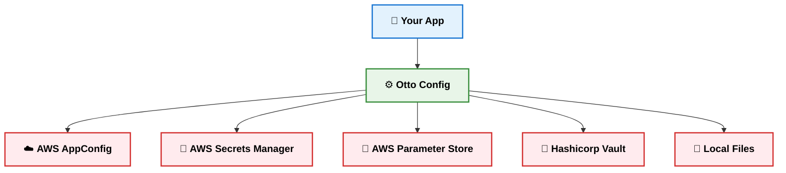
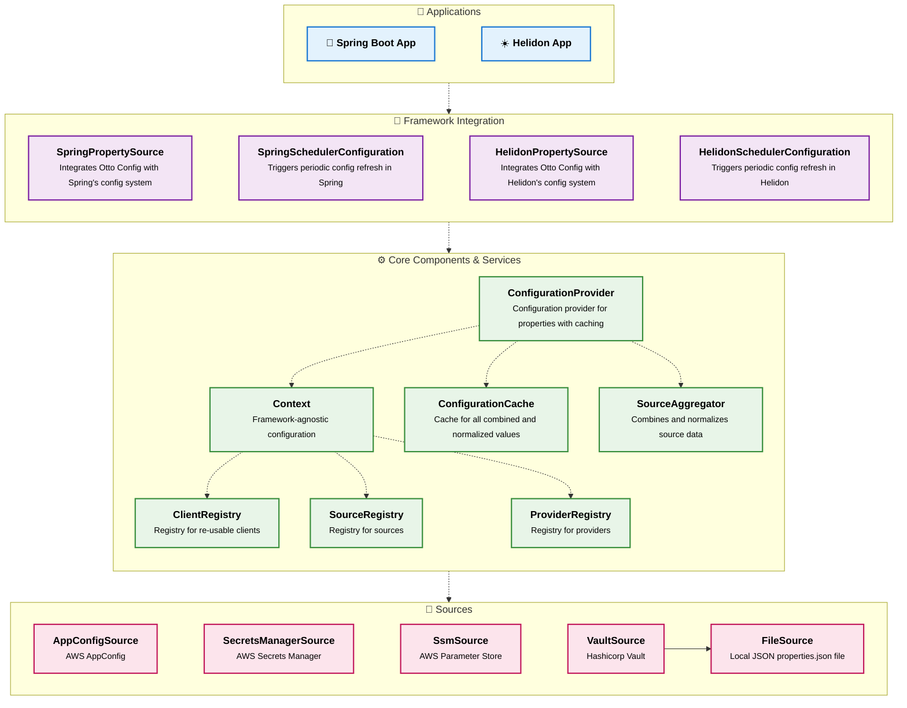
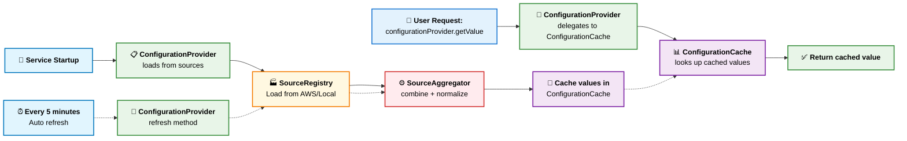

# Advanced Topics

This document covers advanced customization and architecture details for Otto Config.

## Table of Contents
- [Architecture](#architecture)
- [Priority Order](#priority-order)
- [Adding Custom Sources](#adding-custom-sources)
- [Implementing a Custom Provider](#implementing-a-custom-provider)

## Architecture

### High-Level Overview



### Detailed Component Diagram



### Sequence Diagram



## Priority Order

Configuration properties are resolved in this order (highest to lowest priority):
1. **System properties** and environment variables
2. **Otto Config sources** (AWS AppConfig, Secrets Manager, Parameter Store)
3. **Local application config** (application.properties, application.yml)  

This enables local overrides via environment variables for development and testing while maintaining production configurations.

## Adding Custom Sources

Otto Config can be extended to support additional configuration sources beyond those provided out of the box. This section describes how to implement and register a custom source—such as one backed by DynamoDB—so that its configuration data is seamlessly integrated into Otto Config's unified configuration system.

### 1. Implement Your Custom Source

Create a class that extends the `PropertySource` abstract class. For example, here's how you might create a custom source that loads properties from DynamoDB:

```java
package com.mycompany.source;

import de.otto.config.domain.Properties;
import de.otto.config.source.PropertySource;

@Slf4j
@Builder
public class DynamoDbSource extends PropertySource {
    private final DynamoDbClient dynamoDbClient;
    private final String tableName;
    private final String environment;

    @Override
    public Properties load() throws SourceException {
        // Load configuration from DynamoDB
        Map<String, String> properties = new HashMap<>();
        try {
            // ... implementation details
            return new Properties(properties);
        } catch (Exception e) {
            throw new SourceException("Unable to load DynamoDB data.", e);
        }
    }
}
```

### 2. Register Your Source with Otto Config

You can register your custom source in two ways:

#### Option 1: Static Registration (SPI via Factory Class)

1. **Implement a Factory Class**

    Create a class that implements `SourceFactory` and provides a static factory method annotated with `@SourceCreator`. The annotation value is the unique name for your source (e.g., `"dynamodb"`):

    ```java
    package com.mycompany.config;

    import de.otto.config.core.Context;
    import de.otto.config.source.SourceFactory;

    @Slf4j
    public class MySourceFactory implements SourceFactory {

        @SourceCreator("aws.dynamodb")
        public static Source<Properties> createDynamoDbSource(Context context) {
            return DynamoDbSource.builder()
                                 .dynamoDbClient(DynamoDbClient.builder().build())
                                 .tableName("table_name")
                                 .environment(context.getApplicationConfiguration().getValue("environment"))
                                 .build();
        }
    }
    ```

    > **Tip:** To share a client instance (like `DynamoDbClient`) across sources, use the context's client registry `registerIfAbsent` method:

    ```java
    DynamoDbClient dynamoDbClient = context.getClientRegistry().registerIfAbsent(DynamoDbClient.class,
                                                                                 () -> DynamoDbClient.builder().build());
    ```

    > **Tip:** To make your source more flexible for local development and testing, consider checking for a local profile and falling back to a file source (such as `properties.json`) when appropriate using the `CoreSourceFactory` class:

    ```java
    if (CoreSourceFactory.isLocalProfile(context.getProfile())) {
        return CoreSourceFactory.createFileSource(context);
    }
    ```

2. **Register the Factory with SPI**

    Create a file at:

    ```
    resources/META-INF/services/source.core.de.otto.config.SourceFactory
    ```

    Add your factory class's fully qualified name:

    ```
    com.mycompany.config.MySourceFactory
    ```

3. **Enable Your Source in Configuration**

    Add your source's name to the `otto.config.sources.enabled` property:

    ```properties
    otto.config.sources.enabled=aws.appconfig.properties,aws.appconfig.toggles,aws.secrets,aws.ssm,aws.dynamodb
    ```

#### Option 2: Dynamic Registration (At Runtime)

If your source needs runtime parameters or should only be added conditionally, register it dynamically:

```java
// Example: Registering a custom source at runtime
import de.otto.config.core.Context;
import de.otto.config.provider.ConfigurationProvider;

// Inject Context for use in building your source
@Autowired // or @Inject
private Context context;

// Inject ConfigurationProvider
@Autowired // or @Inject
private ConfigurationProvider configurationProvider;

// Register the source with ConfigurationProvider
DynamoDbSource dynamoDbSource = DynamoDbSource.builder()
                                              .dynamoDbClient(DynamoDbClient.builder().build())
                                              .tableName("my-table")
                                              .environment(context.getApplicationConfiguration().getValue("environment"))
                                              .build();
configurationProvider.addSource(dynamoDbSource);
```

With either approach, Otto Config will merge your custom source's data into the unified configuration, making it available alongside all other sources.

## Implementing a Custom Provider

In some cases, you may want to implement your own `Provider<T>` to handle custom data types or specialized configuration needs within your application or service. For instance, you might need to load configuration for internal analytics, auditing, or integration with external systems.

To achieve this, define your own custom type (e.g., `MyCustomType`) and create a new source for it. Instead of implementing `PropertySource`, use the generic `Source<T>` interface with your custom type. For detailed steps on registering your source, refer to [Register Your Source with Otto Config](#2-register-your-source-with-otto-config).

### 1. Create Custom Source for Custom Type

After defining your custom type (e.g., `MyCustomType`), implement a custom source that loads and provides instances of this type:

```java
package com.mycompany.sources;

import de.otto.config.core.Context;
import de.otto.config.source.Source;
import com.mycompany.domain.MyCustomType;
import lombok.Builder;

import java.util.Map;

@Builder
public class MyCustomTypeSource implements Source<MyCustomType> {
  private final Context context;

  @Override
  public Map<String, MyCustomType> load() throws SourceException {
    // Load your custom data here (e.g., from a database, API, or file)
    // Example:
    Map<String, MyCustomType> data = Map.of(
      "exampleKey", new MyCustomType(/* ... */)
    );
    return data;
  }
}
```

Then register the source with Otto Config as normal (see [Register Your Source with Otto Config](#2-register-your-source-with-otto-config)).

### 2. Create Custom Provider

Implement your custom provider by extending the `Provider<T>` abstract class, parameterized with your custom type:

```java
package com.mycompany.providers;

import java.util.Map;
import de.otto.config.core.Context;
import de.otto.config.provider.Provider;
import com.mycompany.domain.MyCustomType;
import lombok.Builder;

public class MyCustomProvider extends Provider<MyCustomType> {

    @Builder
    public MyCustomProvider(Context context) {
        // Pass a transformer function and a list of supported types to the base Provider constructor.
        // This enables your provider to handle values of MyCustomType and expose them via the unified API.
        super(context, List.of(MyCustomType.class), MyCustomType.class::cast, false);
    }
}
```

### 3. Register Your Provider as a Bean (Spring/Helidon)

To use your custom provider in a dependency injection framework like Spring or Helidon, define it as a bean and inject the `Context` into its constructor.

#### Spring Example

```java
import com.mycompany.providers.MyCustomProvider;
import de.otto.config.core.Context;
import org.springframework.context.annotation.Bean;
import org.springframework.context.annotation.Configuration;

@Configuration
public class MyCustomProviderConfig {

  @Bean
  public MyCustomProvider myCustomProvider(Context context) {
    return MyCustomProvider.builder()
                           .context(context)
                           .build();
  }
}
```

#### Helidon Example

```java
import com.mycompany.providers.MyCustomProvider;
import de.otto.config.core.Context;
import jakarta.enterprise.context.ApplicationScoped;
import jakarta.enterprise.inject.Produces;

@ApplicationScoped
public class MyCustomProviderProducer {

  @Produces
  public MyCustomProvider myCustomProvider(Context context) {
    return MyCustomProvider.builder()
                           .context(context)
                           .build();
  }
}
```

You can now inject `MyCustomProvider` wherever needed in your application and use it to access your custom configuration values. For example, to retrieve a value of type `MyCustomType` under the `exampleKey` key:

```java
MyCustomType value = myCustomProvider.getValue("exampleKey");
```

This approach allows you to seamlessly access your custom configuration data throughout your application using your custom provider.
